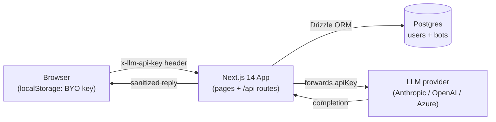

ProBot is a **single Next.js 14 App Router deployment**. There is no separate backend service: pages and `/api/*` routes co-deploy as Vercel serverless functions (or any Node host of your choice).

## Stack at a glance

| Layer             | Choice                                                                                              |
| ----------------- | --------------------------------------------------------------------------------------------------- |
| **Framework**     | Next.js 14 (App Router) + TypeScript 5.6 `strict`                                                   |
| **Styling**       | Tailwind CSS 3.4, custom oklch palette, `next/font/google` (Bricolage Grotesque + Inter Tight)      |
| **ORM**           | Drizzle 0.36 + `drizzle-kit` migrations, `pg.Pool` singleton                                        |
| **Database**      | PostgreSQL (Supabase free tier in production)                                                       |
| **Auth**          | NextAuth.js 4, Credentials provider, JWT session, `bcryptjs` cost 10                                |
| **LLM clients**   | Anthropic + OpenAI + Azure OpenAI adapters; Google stub                                             |
| **BYO-key store** | Browser `localStorage` (`probot.llm.key.v1`, `probot.llm.azure.v1`); `x-llm-api-key` header per req |
| **Markdown**      | `react-markdown` 9 + `remark-gfm` 4 + `SafeLink` for `rel/target`; no `rehype-raw` (XSS-safe)       |
| **Testing**       | Vitest 2.1 + `@vitejs/plugin-react` + Testing Library; node for `.ts`, jsdom for `.tsx`             |
| **Hosting**       | Vercel (primary); Render / Fly.io / Railway / AWS Lightsail / Docker for self-host                  |

## High-level flow



## Repo layout

```
probot/
├── src/
│   ├── app/                       # Next.js App Router
│   │   ├── (auth)/                #   login + register pages
│   │   ├── (dashboard)/           #   authenticated dashboard
│   │   ├── u/[username]/chat/     #   public chat (Stage 4)
│   │   ├── api/
│   │   │   ├── auth/[...nextauth] #   NextAuth handler
│   │   │   ├── auth/register      #   POST /api/auth/register
│   │   │   ├── bots               #   POST /api/bots (upsert)
│   │   │   └── chat/[botId]       #   POST /api/chat/[botId]
│   │   ├── layout.tsx
│   │   ├── page.tsx               #   landing page
│   │   └── globals.css
│   ├── components/
│   │   ├── chat/                  #   ChatWindow, MessageBubble, …
│   │   └── bot-factory/           #   BotFactoryForm
│   └── lib/
│       ├── ai/
│       │   ├── providers/         #   anthropic, openai, azure, google
│       │   ├── key-transport.ts   #   readApiKey / readAzureCreds
│       │   ├── prompt-builder.ts  #   system-prompt assembly
│       │   ├── rate-limit.ts      #   2-tier per-bot rate limit
│       │   ├── sanitize-input.ts  #   ~35 patterns + Unicode normalize
│       │   └── sanitize-output.ts #   4 leakage checks
│       ├── auth/                  #   passwords, schemas, NextAuth opts
│       ├── bots/                  #   Zod schemas + personality presets
│       └── db/                    #   schema.ts + pg.Pool singleton
├── drizzle/                       # SQL migrations
├── claude/                        # PRD, plan, learnings, context
└── docs/                          # this Mintlify site
```

## Data model

Two tables. Both have `id uuid PRIMARY KEY DEFAULT gen_random_uuid()`, `created_at`, `updated_at`.

### `users`

| Column            | Type           | Notes                                                    |
| ----------------- | -------------- | -------------------------------------------------------- |
| `username`        | `varchar(30)`  | unique                                                   |
| `email`           | `varchar(255)` | unique                                                   |
| `hashed_password` | `varchar(255)` | `bcryptjs` cost 10                                       |
| `llm_provider`    | `varchar(20)`  | default `"anthropic"`                                    |
| `llm_model`       | `varchar(60)`  | nullable; provider-specific model id or Azure deployment |
| `email_verified`  | `boolean`      | default `false`                                          |

<Note>
  There is **no `api_key` column**. The LLM API key lives only in browser
  `localStorage` and rides the `x-llm-api-key` header per request. See [BYO-key
  flow](/concepts/byo-key).
</Note>

### `bots`

| Column                | Type           | Notes                                                       |
| --------------------- | -------------- | ----------------------------------------------------------- |
| `user_id`             | `uuid`         | FK → `users.id` `ON DELETE CASCADE`                         |
| `name`                | `varchar(100)` |                                                             |
| `headline`            | `varchar(120)` | nullable                                                    |
| `personality`         | `varchar(20)`  | one of `professional` / `creative` / `enthusiastic`         |
| `context_text`        | `text`         | resume + bio; ≤ 50,000 chars                                |
| `suggested_questions` | `jsonb`        | `string[]`, ≤ 6 entries, each ≤ 200 chars                   |
| `loading_messages`    | `jsonb`        | `string[]`; default `["Thinking…", "Searching memory…", …]` |
| `is_active`           | `boolean`      | default `true`                                              |

## Provider abstraction

All providers implement `LLMProvider.complete()`:

```ts
interface LLMProvider {
  readonly name: ProviderName; // "anthropic" | "openai" | "google" | "azure"
  complete(params: CompleteParams): Promise<CompleteResult>;
}

interface CompleteParams {
  system: string;
  userMessage: string;
  apiKey: string;
  model?: string;
  extras?: Record<string, string>; // azure: { endpoint, apiVersion? }
}

interface CompleteResult {
  reply: string;
}
```

Per-request client construction - **no shared client cached with someone else's key**. A `canary-key` test enforces this at the route and provider layers.

Errors normalize into `ProviderError` with a `category` field:

- `invalid_key` → returns `400 invalid_llm_key` to the caller
- `rate_limit` → returns `429 provider_rate_limit`
- `provider_unavailable` / `timeout` → returns `502 provider_unavailable`

## Request lifecycle (`POST /api/chat/[botId]`)

1. **Content-Type check** - must include `application/json`.
2. **Key transport** - `readApiKey(headers)` extracts `x-llm-api-key`; missing → `400 missing_llm_key`.
3. **Body size cap** - measured byte length ≤ 16,384.
4. **JSON parse** + Zod validation (`message: string, 1..8000 chars`).
5. **Bot lookup** - `bots.id` + `is_active = true`.
6. **Owner lookup** - fetches `llm_provider` + `llm_model`.
7. **Rate limit** - per-bot, 2-tier (short-window + long-window).
8. **Input sanitize** - Unicode-normalize, then ~35 patterns (prompt-injection, role-override, credential-probe).
9. **Provider dispatch** - Azure pulls extra `x-llm-azure-endpoint` + optional `x-llm-azure-api-version` headers.
10. **Provider call** - `provider.complete({ system, userMessage, apiKey, model, extras })`.
11. **Output sanitize** - 4 leakage checks.
12. **Respond** - `{ reply }`.

For the full status-code table, see [`/api/chat/[botId]` reference](/api-reference/chat).
