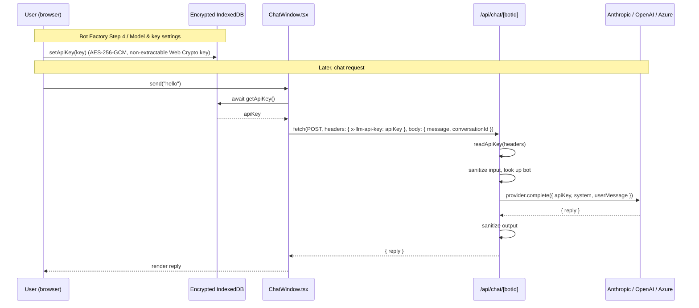

ProBot is **bring-your-own-key**. There are two ways your Anthropic / OpenAI / Azure / Google key can be handled, and you choose:

- **Default - browser-held (zero server trust).** The key lives only in your browser and is sent per chat request; ProBot's server forwards it to the provider and forgets it. Nothing is persisted.
- **Opt-in - managed storage.** You can choose to have ProBot store the key for you, **envelope-encrypted at rest**, so chats work without your browser holding the key. The operator holds the key-encryption key (KEK); see [Managed key storage](/guides/managed-key-storage).

Either way, the key is **never logged**, **never echoed in error messages**, and (in the default mode) **never persisted**. A `canary-key` test enforces this at both the route layer and the provider adapter layer - if a regression ever leaks the key into a response body or log line, the build fails.

## Default mode: browser-held

In the default mode your key:

- Lives in your browser in a **hardened store** - IndexedDB encrypted with a non-extractable Web Crypto **AES-256-GCM** key (`secure-key-store.ts`), not plaintext `localStorage`. (An older `localStorage` entry, `probot.llm.key.v1`, is read **once** and migrated into the encrypted store, then deleted.)
- Rides the `x-llm-api-key` request header - **never the JSON body**.
- Is forwarded straight to the provider's HTTPS endpoint, used once, and discarded.



## Optional mode: managed storage

If you opt in to [managed key storage](/guides/managed-key-storage), your key is wrapped with **envelope encryption** and stored as ciphertext in the `encrypted_llm_keys` table - never as plaintext. On each chat request the server decrypts it just long enough to call the provider, then discards it, and records a row in a **decrypt audit log** (timestamp + a short non-reversible hash). The operator holds the KEK; when you self-host, *you* hold it.

The chat route makes the `x-llm-api-key` header **optional** and resolves the key by priority:

1. **Header** (your browser, or a self-hosted runtime / local test) - always wins.
2. **Managed encrypted key** in `encrypted_llm_keys` - decrypted server-side with the KEK.
3. Otherwise the request fails.

Azure is the one exception: its multi-secret credential (key + endpoint + apiVersion) is header-only, so Azure bots always use the browser-held path.

## Where the key is

| Surface                            | Default (browser-held) | Managed storage (opt-in)                          |
| ---------------------------------- | ---------------------- | ------------------------------------------------- |
| Browser encrypted IndexedDB        | ✅ AES-256-GCM         | Optional                                          |
| HTTP request header                | ✅ `x-llm-api-key`     | Not required                                      |
| HTTPS connection to provider       | ✅ TLS in transit      | ✅ TLS in transit                                 |
| **JSON request body**              | ❌ never               | ❌ never                                          |
| **Server logs**                    | ❌ never               | ❌ never                                          |
| **Postgres rows**                  | ❌ no row written      | ✅ ciphertext only, in `encrypted_llm_keys`       |
| **Error responses**               | ❌ never echoed        | ❌ never echoed                                   |
| **Server memory**                  | Transient - one request | Transient - decrypted per request, then discarded |

> The JSON body is `{ message, conversationId }` - the key is never a body field in either mode.

## Why this shape

A traditional "AI chatbot service" stores your API key server-side and calls the provider on your behalf, with no way to opt out. That gives the service a persistent secret to leak, a surface to subpoena or breach, and an incentive to bill you per request.

ProBot's **default** mode inverts all three - the server is a **stateless forwarder**: no secret to leak, no per-request billing (you pay the provider directly), no vendor lock-in (switch providers in your browser any time). The **managed** mode is a deliberate, opt-in trade: you accept ciphertext-at-rest storage in exchange for chats that don't depend on your browser holding the key - and because it's envelope-encrypted, a database-only breach still exposes nothing usable without the KEK.

## How the key actually moves (default mode)

### 1. Capture - Bot Factory Step 4 / Model & key settings

When you save your key, the client calls `setApiKey(key)`, which writes it to the encrypted store:

```ts
// simplified - src/lib/client/llm-key-store.ts
await setApiKey(key); // → secure-key-store: AES-256-GCM in IndexedDB
```

### 2. Chat send - read and attach

`ChatWindow.tsx` reads the key on each send (async) and attaches it as a header:

```ts
const key = await getApiKey();
if (!key) throw new Error("No LLM key configured");

const res = await fetch(`/api/chat/${botId}`, {
  method: "POST",
  headers: {
    "Content-Type": "application/json",
    "x-llm-api-key": key,
  },
  body: JSON.stringify({ message, conversationId }),
});
```

### 3. Route handler - resolve, forward, discard

```ts
// src/app/api/chat/[botId]/route.ts (excerpt)
// Header is optional; falls back to the managed encrypted key.
const headerApiKey = readApiKey(request.headers); // null if absent
const apiKey = headerApiKey ?? decryptKey(storedManagedKey);
// …
await provider.complete({
  system,
  userMessage: sanitized.message,
  apiKey, // <- forwarded to provider; in default mode, never stored
  model,
  extras,
});
```

After the request resolves, the handler's stack frame (including `apiKey`) is garbage-collected. There is no caching, no in-memory store, no global.

### 4. Provider adapter - per-request client

Each adapter (Anthropic, OpenAI, Azure) constructs a **new client per request** with the supplied key:

```ts
// src/lib/ai/providers/anthropic.ts (simplified)
async complete({ apiKey, system, userMessage, model }) {
  const client = new Anthropic({ apiKey });  // new per call
  const msg = await client.messages.create({ /* … */ });
  return { reply: extractText(msg) };
}
```

No `let cachedClient` outside the function. No `Map<userId, Client>`. The `canary-key` test plants a known canary string as an api key and asserts it appears **only** in the outbound HTTPS payload - never in a response, never in a log mock.

## Failure modes (and how the key is protected in each)

| Failure                       | What happens                                                                                                                         | Key safe? |
| ----------------------------- | ------------------------------------------------------------------------------------------------------------------------------------ | --------- |
| User pastes wrong key         | Provider returns 401 → adapter throws `ProviderError("invalid_key")` → route returns `{ error: "invalid_llm_key" }`. Key not echoed. | ✅        |
| Provider rate-limits          | `ProviderError("rate_limit")` → `429 provider_rate_limit`                                                                            | ✅        |
| Provider is down              | `ProviderError("provider_unavailable")` → `502`                                                                                      | ✅        |
| Managed KEK unavailable       | Decrypt fails → `503 managed_storage_unavailable`. No partial key exposure.                                                          | ✅        |
| Network drops mid-request     | Handler aborts; no persistence anywhere (default mode)                                                                               | ✅        |
| User runs **Clear site data** | Encrypted store wiped; next chat shows "No LLM key configured" (unless managed storage is on)                                        | ✅        |

## Threat model

BYO-key protects you against:

- **Server-side breach of ProBot.** In default mode there is no key column, cache, or log. In managed mode the stored value is ciphertext only - useless without the KEK.
- **Cross-tenant leakage.** Every request constructs a fresh provider client.
- **Vendor lock-in / surprise billing.** You hold the contract with Anthropic / OpenAI / Azure.

BYO-key does **not** protect you against:

- **Compromised browser** (a malicious extension reading the encrypted store's decrypted output in-page).
- **XSS on the ProBot frontend.** The frontend mitigates this with `react-markdown` + no `rehype-raw`, but if you find one, please report via [SECURITY.md](https://github.com/vishalpatil18/probot/blob/main/SECURITY.md).
- **Phishing.** A lookalike `probot-app.com` could capture pasted keys.
- **Full infrastructure compromise in managed mode.** Anyone with deploy access can read the KEK; if that's your threat model, use default (browser-held) mode or self-host. See [Managed key storage](/guides/managed-key-storage).

For the input/output sanitization layer, see [Security](/concepts/security).
