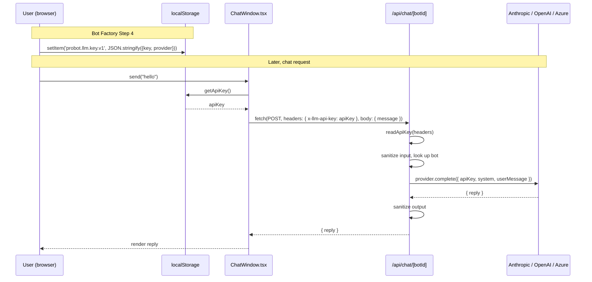

ProBot is **bring-your-own-key**. Your Anthropic / OpenAI / Azure / Google key:

- Lives in your browser's `localStorage` under `probot.llm.key.v1` (and `probot.llm.azure.v1` for Azure endpoint + apiVersion).
- Rides the `x-llm-api-key` request header - **never the JSON body**.
- Is forwarded straight to the provider HTTPS endpoint.
- Is **never logged**, **never persisted**, and **never echoed in error messages**.

A `canary-key` test enforces this at both the route layer and the provider adapter layer. If a regression ever leaks the key into a response body or log line, that test fails the build.

## The full path



## Where the key is

| Surface                            | Has key?  | Notes                                                  |
| ---------------------------------- | --------- | ------------------------------------------------------ |
| Browser `localStorage`             | ✅        | `probot.llm.key.v1` (+ `probot.llm.azure.v1`)          |
| HTTP request header                | ✅        | `x-llm-api-key` only; cleared after response           |
| HTTPS connection to provider       | ✅        | TLS-encrypted in transit                               |
| **JSON request body**              | ❌        | Schema is `{ message: string }`, nothing else accepted |
| **Server logs**                    | ❌        | Never logged at any layer                              |
| **Postgres `users` / `bots` rows** | ❌        | No column exists for it                                |
| **Error responses**                | ❌        | Errors never echo the key, even on `invalid_llm_key`   |
| **Vercel function memory**         | Transient | Lives only for the duration of one request handler     |

## Why this shape

A traditional "AI chatbot service" stores your API key server-side and calls the provider on your behalf. That gives the service:

- A persistent database row with your secret.
- A surface that can be subpoenaed, breached, or weaponized by a malicious employee.
- An incentive to bill you per request.

BYO-key inverts all three. ProBot's server is a **stateless forwarder** for chat requests:

- No secret to leak - server-side breach exposes nothing about your provider account.
- No per-request billing - you pay the provider directly at their rates.
- No vendor lock-in - switch providers in your browser at any time.

## How the key actually moves

### 1. Bot Factory Step 4 - capture

When you submit Step 4 of the bot factory, `BotFactoryForm.tsx` calls `setApiKey({ key, provider })`:

```ts
// simplified
function setApiKey(payload: { key: string; provider: ProviderName }) {
  localStorage.setItem("probot.llm.key.v1", JSON.stringify(payload));
}
```

### 2. Chat send - read and attach

`ChatWindow.tsx` reads the key on each send and attaches it as a header:

```ts
const { key } = getApiKey() ?? {};
if (!key) throw new Error("No LLM key configured");

const res = await fetch(`/api/chat/${botId}`, {
  method: "POST",
  headers: {
    "Content-Type": "application/json",
    "x-llm-api-key": key,
  },
  body: JSON.stringify({ message }),
});
```

### 3. Route handler - extract, forward, discard

```ts
// src/app/api/chat/[botId]/route.ts (excerpt)
const apiKey = readApiKey(request.headers); // throws KeyTransportError if missing
// …
await provider.complete({
  system,
  userMessage: sanitized.message,
  apiKey, // <- forwarded to provider, never stored
  model,
  extras,
});
```

After the request resolves, the handler's stack frame (including `apiKey`) is garbage-collected. There is no caching, no in-memory store, no global.

### 4. Provider adapter - per-request client

Each adapter (Anthropic, OpenAI, Azure) constructs a **new client per request** with the supplied key:

```ts
// src/lib/ai/providers/anthropic.ts (simplified)
async complete({ apiKey, system, userMessage, model }) {
  const client = new Anthropic({ apiKey });  // new per call
  const msg = await client.messages.create({ /* … */ });
  return { reply: extractText(msg) };
}
```

No `let cachedClient` outside the function. No `Map<userId, Client>`. A single test (`canary-key.test.ts`) plants a known canary string as an api key and asserts it appears **only** in the outbound HTTPS payload - never in a response, never in a log mock.

## Failure modes (and how the key is protected in each)

| Failure                       | What happens                                                                                                                         | Key safe? |
| ----------------------------- | ------------------------------------------------------------------------------------------------------------------------------------ | --------- |
| User pastes wrong key         | Provider returns 401 → adapter throws `ProviderError("invalid_key")` → route returns `{ error: "invalid_llm_key" }`. Key not echoed. | ✅        |
| Provider rate-limits          | `ProviderError("rate_limit")` → `429 provider_rate_limit`                                                                            | ✅        |
| Provider is down              | `ProviderError("provider_unavailable")` → `502`                                                                                      | ✅        |
| Network drops mid-request     | Handler aborts; no persistence anywhere                                                                                              | ✅        |
| Browser tab closes            | Header in flight; key remains only in `localStorage`                                                                                 | ✅        |
| User runs **Clear site data** | Key gone from `localStorage`; next chat shows "No LLM key configured"                                                                | ✅        |

## Threat model

BYO-key protects you against:

- **Server-side breach of ProBot.** There is no key column, no key cache, no key in logs.
- **Cross-tenant leakage.** Every request constructs a fresh provider client.
- **Vendor lock-in / surprise billing.** You hold the contract with Anthropic / OpenAI / Azure.

BYO-key does **not** protect you against:

- **Compromised browser** (malicious extension reading your `localStorage`).
- **XSS on the ProBot frontend** that exfiltrates `localStorage`. The frontend mitigates this with `react-markdown` + no `rehype-raw`, but if you find one, please report via [SECURITY.md](https://github.com/vishalpatil18/probot/blob/main/SECURITY.md).
- **Phishing.** A lookalike `probot-app.com` could capture pasted keys.

For the input/output sanitization layer, see [Security](/concepts/security).
