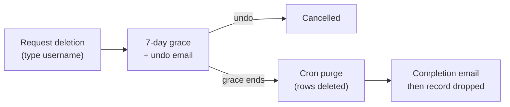

ProBot is built so you can take your data with you and remove it entirely. Both flows live in **Settings → Account**.

## Export your data

You can download a portable JSON bundle of everything the system holds about you: your profile, every bot, its knowledge chunks, conversations, messages, and captured leads.

The export deliberately **excludes**:

- your password hash (a hash isn't useful to you and exporting it invites offline cracking),
- any server-stored, envelope-encrypted LLM keys (meaningful only with the operator's KEK), and
- raw OAuth tokens (these are provider-side state and can be reissued).

The format is plain JSON so it's trivially diffable by you and by tools - no archive format, no extra dependency.

## Delete your account

Deletion is a deliberate, reversible-for-a-while flow modelled on GitHub's:

1. In **Settings → Account** you click **Delete account** and type your username to confirm. The server re-verifies the typed username against your live record (defence in depth).
2. A **7-day grace period** begins. Your account is scheduled for purge, and you receive an email with an **undo** link.
3. Any time in those 7 days, the undo link (or signing back in, depending on your settings) cancels the deletion.
4. After the grace period a scheduled job purges your rows. A short post-purge window is kept only so the completion email can be delivered, then the deletion record itself is dropped.

The 7-day grace prevents accidental or coerced deletion from being instantly irreversible, while still guaranteeing the data is gone on a predictable schedule. The legacy 30-day figure is retained only as a final backstop constant.

## Self-hosted note

When you self-host, the same flows run against *your* database and *your* cron schedule - nothing is sent to pro-bot.dev. See [Managed vs self-hosted](/concepts/managed-vs-self-hosted).
