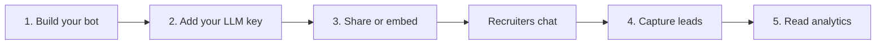

ProBot turns your resume, LinkedIn, and portfolio into an AI chatbot that answers recruiters' questions in your voice, 24/7. This page is the high-level tour; each feature links to its own guide.

## The big picture

## 1. Build your bot

Upload your resume PDF, paste your bio or LinkedIn text, set a name, headline, and personality, and pick a theme. ProBot indexes your knowledge into a private vector store. See [Build your bot](/guides/build-your-bot).

## 2. Add your own LLM key

ProBot is bring-your-own-key: you supply a key for Claude, OpenAI, Azure, or Gemini. It stays encrypted in your browser by default and is never billed by us. See [Models & keys](/guides/models-and-keys).

## 3. Share or embed

Every bot gets a public link (`pro-bot.dev/u/<username>/chat`) and a one-line embed widget for your portfolio. See [Embed & share](/embed-share).

## 4. Capture leads

When a recruiter is interested, an in-chat form collects their **name, email, company** (required) and **LinkedIn** (optional). Leads appear in your dashboard and can be exported to CSV. See [Analytics & leads](/guides/analytics-and-leads).

## 5. Read your analytics

The dashboard shows conversations, messages, and leads with live week-over-week and month-over-month change figures, plus a daily activity chart. See [Analytics & leads](/guides/analytics-and-leads).

## Managing the bot

Toggle it live/off (saves instantly), edit its configuration, manage knowledge, set rate limits, choose a deployment mode, and save your settings as a reusable preset. See [Managing your bot](/guides/bot-management).
