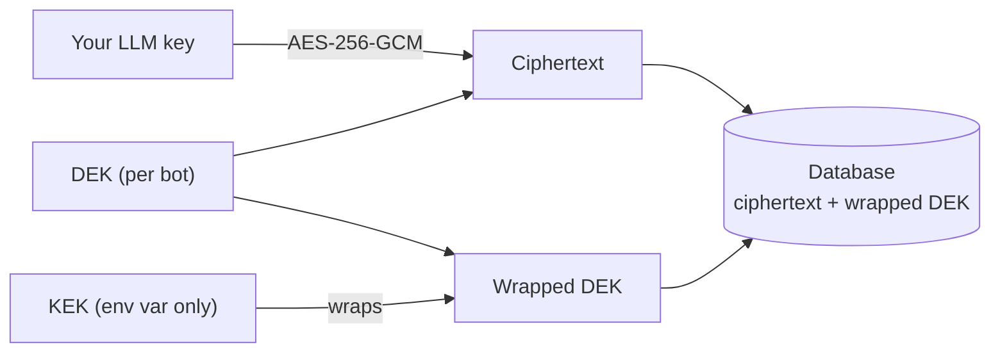

By default your LLM API key stays in your browser and is sent per request. If you'd rather not re-enter it on every device, you can opt in to **managed key storage**, where the key is encrypted and stored on the server. This page explains exactly what that means.

## The default: browser-only

Without opting in, your key lives in a hardened browser store - IndexedDB plus a **non-extractable** Web Crypto AES-256-GCM key. DevTools, casual storage exports, and stolen browser snapshots see ciphertext, not your key. The key is sent per request in the `x-llm-api-key` header, used once, and discarded server-side.

The residual risk is malicious JavaScript on the same origin (XSS), which could call `decrypt()` directly - so ProBot ships no `rehype-raw`, sanitizes all rendered markdown, and keeps a strict origin.

## The opt-in: envelope encryption

When you store a key server-side, ProBot uses **envelope encryption** rather than a single static secret:

1. A **KEK** (Key Encryption Key) - a 32-byte symmetric key - lives only in the `PROBOT_KEY_ENCRYPTION_KEY` environment variable. Never in the database, never in git, never in a DB backup.
2. A fresh **DEK** (Data Encryption Key) is generated per bot. The DEK encrypts your LLM key with AES-256-GCM.
3. The DEK is itself encrypted ("wrapped") with the KEK and stored next to the ciphertext.
4. At chat time the server loads the ciphertext + wrapped DEK, unwraps the DEK with the KEK, decrypts your key, calls the provider, and discards everything from memory.

## Why this matters

A database dump, a SQL-injection read, or a stolen backup yields only ciphertext and a wrapped DEK - both useless without the KEK, which isn't in the database. To rotate, change the KEK and re-wrap; the underlying LLM key never has to be re-entered if you script the re-wrap.

When you **self-host**, you own the KEK, so even the managed operator cannot decrypt your stored key. See [Managed vs self-hosted](/concepts/managed-vs-self-hosted).
