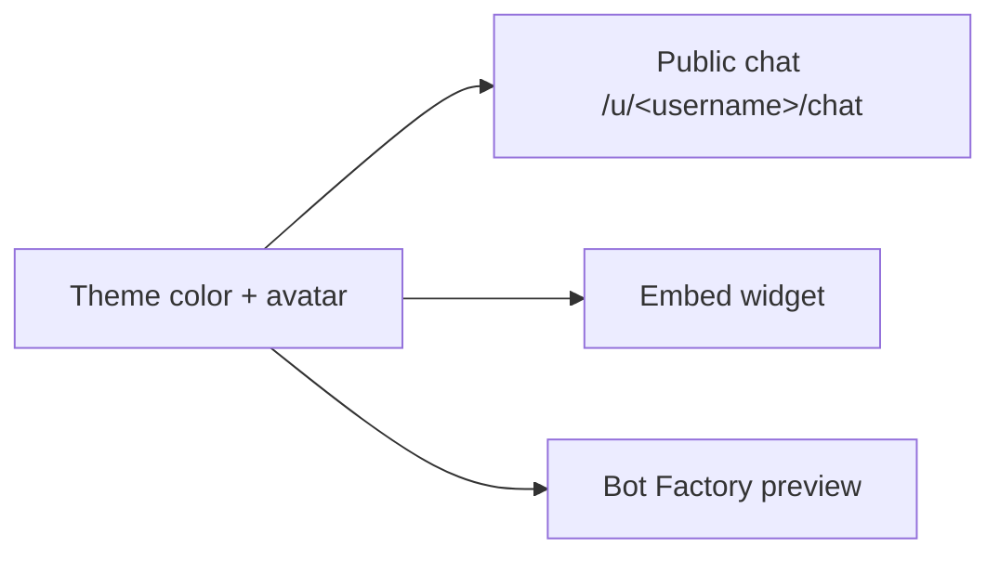

Your bot can carry your personal brand: a **theme color** and an **avatar** that appear on the public chat page and the embeddable widget.

## Theme color

Set the theme color in **Settings → Bot configuration** (or during the Bot Factory wizard). It drives the accent across the chat: the header avatar tint, the send button, your message bubbles, the loading indicator, and the suggested-question chips. A live preview updates as you pick.

Choose any color, or use a preset (Blue, Red, Green, Black).

## Avatar

Upload a custom bot picture (JPG, PNG, or WebP, up to 2 MB). Hover the avatar in the configuration panel to change it. When set, it shows:

- on the public chat header,
- next to each of the bot's replies,
- in the embeddable widget, and
- in the Bot Factory live preview.

If you don't upload one, the bot uses the default **ProBot mark** (a two-dot icon) tinted with your theme color - never placeholder initials or an "AI" label.

## Where it shows

The public chat shows only your bot's identity - name, headline, avatar - not your personal account profile.
