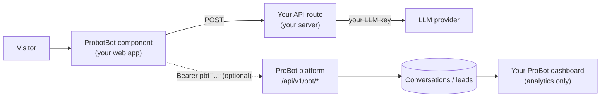

Self-hosting a ProBot chatbot means installing the
[`probot-self-hosted`](https://www.npmjs.com/package/probot-self-hosted)
npm package in your web app and configuring the bot in code. There is no
separate runtime repo to clone, no extra hosting to babysit, and no LLM key
ever leaves your own backend.

## When to choose this

- You want the chat to run entirely inside your own web app.
- You want zero trust in any operator for the chat path or the LLM key.
- You want the bot config, persona, and knowledge to live in your codebase,
  version-controlled with the rest of your app.

For most people the **managed** mode (served at
`pro-bot.dev/u/<username>/chat` and via the embed widget) is simpler -
nothing to install. See [Managed vs self-hosted](/concepts/managed-vs-self-hosted).

## How it fits together



1. A visitor chats with `<ProbotBot />` inside your web app.
2. The component calls a `sendMessage` function you provide - typically a
   fetch to `/api/probot-chat` on your own server, which calls the LLM
   provider with your key.
3. If you pass a `dashboard.token`, the component POSTs the finished
   transcript and any captured lead to the ProBot platform's versioned API
   so they appear in your dashboard for analytics. Config on the dashboard
   is read-only for self-hosted bots.

## Setup

Five steps from `npm i` to a working chatbot.

<Steps>
  <Step title="Install the package">
    ```bash
    npm i probot-self-hosted
    ```
  </Step>
  <Step title="Wire a server-side chat proxy">
    Create an API route that holds your LLM key and calls the provider:

    ```ts
    // app/api/probot-chat/route.ts (Next.js example)
    import { createOpenAIHandler } from "probot-self-hosted/adapters/openai";

    const send = createOpenAIHandler({
      apiKey: process.env.OPENAI_API_KEY!,
      model: "gpt-4o-mini",
    });

    export async function POST(req: Request) {
      const { system, messages } = await req.json();
      const reply = await send({ system, messages });
      return Response.json({ reply });
    }
    ```
  </Step>
  <Step title="Render the widget">
    ```tsx
    "use client";
    import { ProbotBot } from "probot-self-hosted";

    export function Widget() {
      return (
        <ProbotBot
          name="Ada"
          headline="Ask me about my work"
          personality="professional"
          themeColor="#2563eb"
          context={`I'm Ada Lovelace, a mathematician…`}
          suggestedQuestions={["What are you working on?"]}
          captureLead
          sendMessage={async ({ system, messages }) => {
            const res = await fetch("/api/probot-chat", {
              method: "POST",
              headers: { "content-type": "application/json" },
              body: JSON.stringify({ system, messages }),
            });
            return (await res.json()).reply;
          }}
        />
      );
    }
    ```
  </Step>
  <Step title="Register the bot (optional, for analytics)">
    Open the ProBot dashboard → **Register self-hosted bot** in the sidebar
    bot switcher. You get a `pbt_…` token, shown once. Copy it.
  </Step>
  <Step title="Link the dashboard">
    Pass the token to the widget:

    ```tsx
    <ProbotBot
      /* ...same as above... */
      dashboard={{ token: process.env.NEXT_PUBLIC_PROBOT_TOKEN! }}
    />
    ```

    Every completed conversation and captured lead now shows up in your
    dashboard's Conversations and Leads tabs.
  </Step>
</Steps>

<Warning>
  Keep your LLM API key server-side only. `sendMessage` should always call
  your own API route (which holds the key) - never pass the raw key into a
  browser-rendered component. `createOpenAIHandler` is server-only.
</Warning>

## Framework examples

- [Next.js (App Router)](/self-hosted-bot/nextjs)
- [React + Vite](/self-hosted-bot/react)
- [Vanilla HTML script tag](/self-hosted-bot/vanilla)
- [Dashboard integration](/self-hosted-bot/dashboard-integration)
- [Troubleshooting](/self-hosted-bot/troubleshooting)

## Security model

The optional dashboard token (`pbt_…`) grants conversation + lead writes for
one bot. A leaked token cannot mint tokens, read knowledge, or affect other
bots or tenants. Revoke it from **Dashboard → Settings → Deployment** and
the platform rejects it instantly. Your LLM API key is out of scope for the
platform entirely - it never leaves your backend.

Next: the [dashboard API reference](/self-hosted-bot/api-reference) for the
`/api/v1/bot/{conversations,leads}` contract used by the optional analytics
link.
