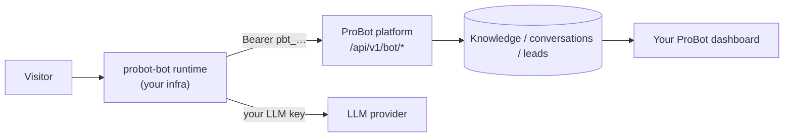

Self-hosting in ProBot means running **your bot's chat** on your own infrastructure - not operating the whole platform. You deploy the tiny [`probot-bot`](https://github.com/vishalpatil18/probot-bot) runtime under your own domain; pro-bot.dev keeps doing the heavy lifting - knowledge retrieval, conversation logging, and lead capture. Your LLM key stays in your runtime; the platform never sees it.

## When to choose this

- You want the chat served from your own domain/infrastructure.
- You want zero trust in any operator for the chat path.
- You want a tiny, auditable deployment surface (not the whole platform).

For most people the **managed** mode (served at `pro-bot.dev/u/<username>/chat` and via the embed widget) is simpler - nothing to deploy. See [Managed vs self-hosted](/concepts/managed-vs-self-hosted).

## How it fits together



1. A visitor chats with your runtime.
2. The runtime asks the platform for the relevant knowledge + your bot's persona.
3. The runtime calls **your** LLM provider and replies.
4. The runtime posts the transcript + any lead back to the platform, so they appear in your ProBot dashboard exactly like a managed bot.

## Setup

Five steps from a managed bot to a self-hosted one.

<Steps>
  <Step title="Build a bot">
    Create a bot in the ProBot dashboard as usual (resume, persona, knowledge).
  </Step>
  <Step title="Switch to self-hosted">
    Open the bot's **Settings → Deployment** and select **Self-hosted**.
  </Step>
  <Step title="Mint a token">
    Click **Generate token**, give it a name (e.g. "Vercel production"), and
    **copy the `pbt_…` secret now** - it's shown only once.
  </Step>
  <Step title="Configure the runtime">
    Clone [`probot-bot`](https://github.com/vishalpatil18/probot-bot), copy
    `.env.example` to `.env.local`, and set:

    ```bash
    PROBOT_API_URL=https://pro-bot.dev
    PROBOT_BOT_TOKEN=pbt_xxxxxxxx…   # the token from step 3
    OPENAI_API_KEY=sk-…              # your own LLM key (runtime calls the model)
    ```
  </Step>
  <Step title="Deploy">
    `npm install && npm run build`, then deploy to Vercel or any Node 20+ host.
    Point your domain at it and share the link.
  </Step>
</Steps>

### Verify

Chat with your deployed runtime, then open your ProBot dashboard - the
conversation (and any captured lead) appears under that bot, just like a managed
one.

### Revoking access

To cut a runtime off, go back to **Settings → Deployment** and **Revoke** the
token. The platform rejects it on the next call immediately - no redeploy
needed.

<Warning>
  Keep `PROBOT_BOT_TOKEN` and `OPENAI_API_KEY` server-side only. Never expose
  them to the browser. If a token leaks, revoke it and mint a new one.
</Warning>

## Security model

Authentication is a **per-bot token** (`pbt_…`), minted in the dashboard and
shown once. A leaked token grants only read-only knowledge for that one bot plus
conversation/lead writes for it - no cross-tenant access. Revoke it from the
dashboard and the platform rejects it instantly.

Next: the [bot runtime API reference](/self-hosted-bot/api-reference) for the
full `/api/v1/bot/*` contract.
