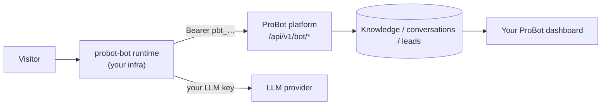

A **self-hosted bot** runs the chat on *your* infrastructure using the tiny
[`probot-bot`](https://github.com/vishalpatil18/probot-bot) runtime, while the
ProBot platform keeps doing the heavy lifting - knowledge retrieval,
conversation logging, and lead capture. Your LLM key stays in your runtime; the
platform never sees it.

## When to choose this

- You want the chat served from your own domain/infrastructure.
- You want zero trust in any operator for the chat path.
- You want a tiny, auditable deployment surface (not the whole platform).

For most people the **managed** mode (served at `pro-bot.dev/u/<username>/chat`
and via the embed widget) is simpler - nothing to deploy. See
[Managed vs self-hosted](/concepts/managed-vs-self-hosted).

## How it fits together

1. A visitor chats with your runtime.
2. The runtime asks the platform for the relevant knowledge + your bot's persona.
3. The runtime calls **your** LLM provider and replies.
4. The runtime posts the transcript + any lead back to the platform, so they
   appear in your ProBot dashboard exactly like a managed bot.

## Security model

Authentication is a **per-bot token** (`pbt_…`), minted in the dashboard and
shown once. A leaked token grants only read-only knowledge for that one bot plus
conversation/lead writes for it - no cross-tenant access. Revoke it from the
dashboard and the platform rejects it instantly. See
[ADR 0004](/decisions/0004-self-hosted-bot) for the full design and threat
model.

Next: the [quickstart](/self-hosted-bot/quickstart) and the
[API reference](/self-hosted-bot/api-reference).
